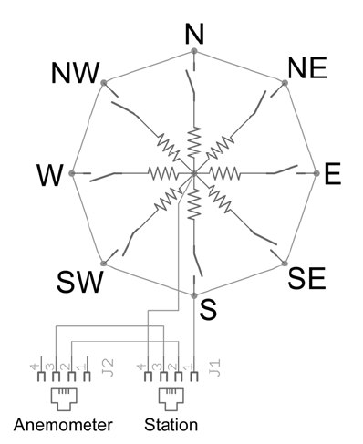
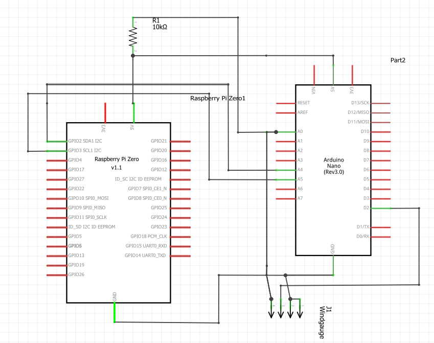
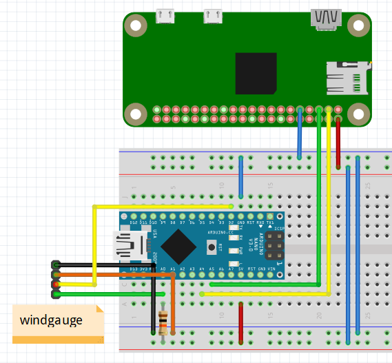
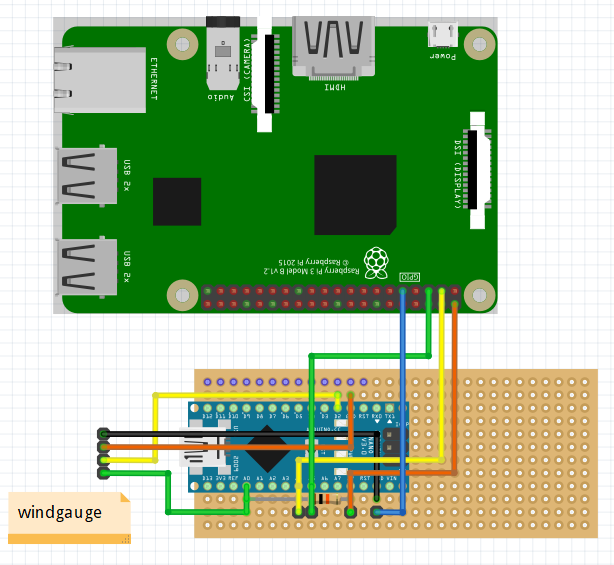
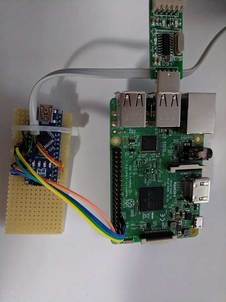
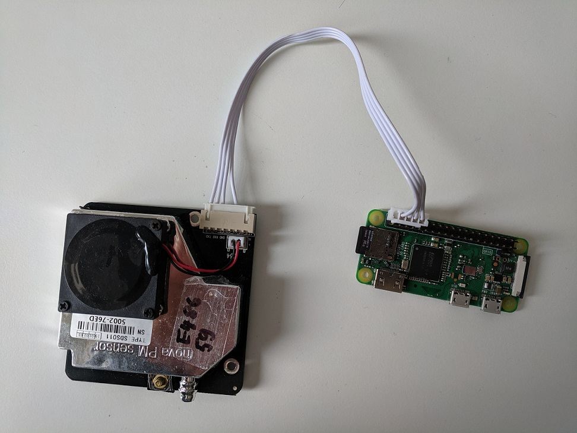
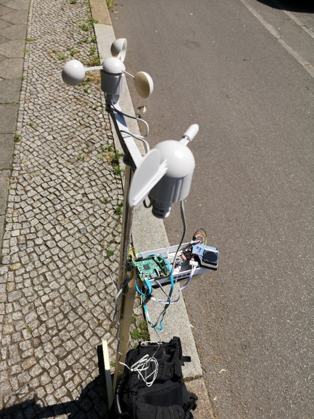

# Particulate matter sensor mesh#

To build up a network of particulate matter sensors we will first describe how to build the hardware. Then we will describe how to set it up for a particular measurement and how to install the software.

# Hardware setup
To build up the hardware necessary for our network we need to assemble the parts given in the bill of materials. Additionally some wires and a 10k resistor are needed.
## Master setup
Our Master PI will be connected to the weather station and will gather the weather data and supply the WIFI. As the weather station supplies an analogue signal, we need an external controller for that, because the PI does not have an ADC.
We use an Arduino nano because it is very compact and cheap. 
In this picture one can see how the wind vane is internally connected. For each direction it connects one resistor to the two ports. If the direction is in between two resistors both are connected in parallel.
Due to the unique selection of resistor values a voltage divider can be build up to determine the direction from the voltage level. 
So we connect one end of the vane to 5V the other to our Arduino ADC and a 10k resistor, which is connected to GND.
The voltage reading is then transformed in the Arduino to a direction.



In the picture one can see that the anemometer for the windspeed is also connected to vane and that only one wire goes from both to the final plug. 
We therefore use the Arduino as well for the vane data, although this would not be necessary as the PI would have the possibility to use timed interrupts. 
The vane closes a connect for every turn of the rotor. Therefore this can be used as an external interrupt source. 
We configure the Pin as pull up and issue the interrupt on every falling edge (rising edge would be possible as well).
From the interrupts and the turns we can then calculate the wind speed. 
To average the wind speed we built a ring buffer and average it for 10 interrupts. 
We do this because for higher wind speed the number of milliseconds between to interrupts is very low. Therefore we assume a higher error. This might need further investigation, but we neither had the time nor the resources. 
This also is not too important as the wind speed fluctuates anyways.
```
void interrupt(){
  zeitring[indexzeit]= millis() - counter;
  indexzeit+=1;
  if(indexzeit==10){
    indexzeit=0;
    zeit=0;
    for(int i=0;i<10;i++){    
      zeit+=zeitring[i];
    }
    Serial.println(indexzeit);
    zeit=zeit/10;
    Serial.println(zeit);
  }
  counter = millis();
}
```
The basics are clear now, so we can start to make the schematic, which looks like this.
The schematics and assembly views are made with fritzing https://fritzing.org/home/ software and can be found in `/Hardware/` in this git repo.

 
 
The picture shows how we hooked up the Arduino with the PI over an I2C bus. They both work fine with this. The Pi is the master and pulls the data which lay on the Arduino. 
The Arduino is powered from the PI so in the end the Powerbank only needs to be connected to the PI.
When we connect everything on a breadboard to test it it looks like this.

 
 
The Windgauge usually has a plug connection but we don't need it so we just cut the wire and plugged it directly. In the pictures we use the same colors as in the wire.
As one may notice it is not important which Raspberry we use, as they have the same pinouts.

 
 



After soldering the bread board, connect the jumpers from Arduino to the master PI, as shown in the picture. The connections are 5V(orange), GND(blue), SCL(green) and SDA(yellow).
We use the wire strap as strain relief, because the wire to the weather station is fairly long. 
The hardware is now prepared and can be used.

##Slave setup
the connection of a slave to a PM sensor is very simple. Just connect to wire from the PM sensor directly to the PI. Pay attention that the empty pin of the plug is above a pin of the Pi.
connectPM: 



This connection is valid for all PIs regardless of the kind as they have the same pinout.
# Measurement Setup
In this section we describe how to set up the measuring units for a measurement.

## Master station
* The wind vane is already soldered to the Arduino. Connect the Arduino to the master PI according to the description above, if it is not connected already.
* Connect the GPS Module to a USB-Plug.
* Build up the weather station like described here https://www.sparkfun.com/datasheets/Sensors/Weather/Weather%20Sensor%20Assembly..pdf and plug in the anemometer to the vane. The anemometer is connected through the vane to the PI.
 This may look like this
 
 
 
We build wooden stands for the measurements, but this is highli individual and depends on the measuring setup. Therefore we do not describe it here. ON the stand for one PI we also mounted the weather station.

## Slave setup
* Mount all the PM sensors and according PIs with their power banks, where they should be placed for the measurement. You may want to save them from water and secure them from theft. 
* Pay attention to not put them in airtight compartments as this might result in wrong measurement. For accurate values it is important to place the sensors upright.
* Connect all PIs to their power bank. The measurement starts automatically.

## Gathering Data
Connect to the Network 'DCAITI_Feldversuch' with the password 'dcaiti_wlan_passwort'. You can now connect to the master system via sftp://pi@master.dcaiti and find the measurements with a timestamp and its MAC-Adress in the home directory. The files have the form '$MAC_YYYYMMDDHHSS.csv'.

# Software Installation
First of all, start with the configuration of the Raspberry Pi itself. Start `sudo raspi-config` and choose the `Interfacing Options`. There you have to 'disable shell and kernel messages on the serial connection' to allow communication with a PM-Sensor. Also enable `SSH` to make a connection to your clients available (debug etc.). Go back to the main menu and chose `Localisation Options`. Choose the locale which suits your location. This is important for W-Lan configuration, since the allowed frequencys and signal strengts differ from country to country. Save the choosen Options and restart your Pi. 
## Master

### W-Lan AP
Collection of data and synchronization of time will be achieved via W-Lan. Connect to your device via cable and add following lines to `/etc/dhcpcd.conf`:
```
interface wlan0
static ip_address=10.0.0.1/16 # 10.0.0.0 - 10.0.255.255
```
#### hostapd
Restart the dhcp client daemon via `sudo systemctl restart dhcpcd`. Install the necessary software packages for an Access Point:
`sudo apt install dnsmasq hostapd`. Backup the hostapd config file via `cp /etc/hostapd/hostapd.conf /etc/hostapd/hostapd.conf.old` and replace it by the one in this Repo (`service_files/hostapd.conf`). Keep in mind to change the password and make it only readable by root `chmod 600 /etc/hostapd/hostapd.conf`. Edit `/etc/defaults/hostapd` to contain following lines:
```
DAEMON_CONF="/etc/hostapd/hostapd.conf"
```
RUN_DAEMON=yes
Start and enable the service:
```
systemctl unmask hostapd
systemctl restart hostapd
systemctl start hostapd
```
#### dnsmasq
This will distribute ip configuration and give name resolution to your network.
Backup old `dnsmasq.conf` and copy the one from the repo to  `/etc/dnsmasq.conf`
```
systemctl restart hostapd
systemctl start hostapd
```
Add `10.0.0.1	master.dcaiti` to `/etc/host`

#### NTP / GPS
Install the packages `gpsd` and `ntp`. Add following lines to your `/etc/ntp.conf`:
```
server 127.127.28.0 prefer # GPS via SHM 
# GPS data via SHM driver
# flag1: Skip the difference limit check if set, see: http://doc.ntp.org/4.2.8/drivers/driver28.html
fudge 127.127.28.0 flag1 1 refid GPS

# announce this instance to our measurement network 
restrict 10.0.0.0 mask 255.255.0.0 nomodify notrap
```

Edit `/etc/defaults/gpsd` to contain following line:
```
DEVICES="/dev/ttyUSB0"
```
The gps daemon will probe the GPS module via the USB/UART-Bridge. Finally start and enable those services:
```
systemctl start ntp
systemctl enable ntp
systemctl start gpsd
systemctl enable gspd
```
Disable the timesync daemon:
```
systemctl stop systemd-timesyncd
systemctl disable systemd-timesyncd
```

You can check ntp and gps via `cgps` or `ntpq -pn`.

#### SSH Server
Measurement clients will push there data via ssh to the master system. Authentication will be achieved by publickey authentication. Edit `/etc/ssh/sshd_config` to contain following lines:
```
PubkeyAuthentication yes

# Expect .ssh/authorized_keys2 to be disregarded by default in future.
AuthorizedKeysFile	.ssh/authorized_keys .ssh/authorized_keys2
```
Start and enable sshd:
```
systemctl start sshd
systemctl enable sshd
```

## Client
With the start of the service at the end, the clients should push there data to the master system. This will only happen, if they got a synchronization with NTP and are connected to the correct network (checked with `nslookup master.dcaiti`).

### W-Lan
Edit `/etc/wpa_supplicant.conf` to contain following network config:
```
country=DE

network={
        ssid="DCAITI_Feldversuch"
        psk="dcaiti_wlan_passwort"
        key_mgmt=WPA-PSK
        priority=1
}
```
### Gather scripts
Copy `RPi-script/aqi.py` and `RPi-script/data_crawler.sh` to `/usr/local/bin/dcaiti`. Make it executable with `chmod +x /usr/local/bin/dcaiti/aqi.py`

### SSH authentication
To let the client connect autonomous to the master for gathering porposes, we need a key-pair for this. Generate one for the standard user (`pi`) with `ssh-keygen -t rsa -b 4096` and add the public key to the master system for the same user.

### systemd service
Copy `service_files/dcaiti_pm.service` to `/etc/systemd/system`. Enable and start it.

## Arduino
To install the needed software for the Arduino one needs to download the Arduino Software from https://www.arduino.cc/en/main/software and check out this github repo. Open the wetter.ino in `PMsa\Arduino\wetter` with the downloaded Arduino studio.
Select the correct Arduino and connecting port. Then compile and load it to the Arduino. Once the Arduino is powered it starts automatically. 
